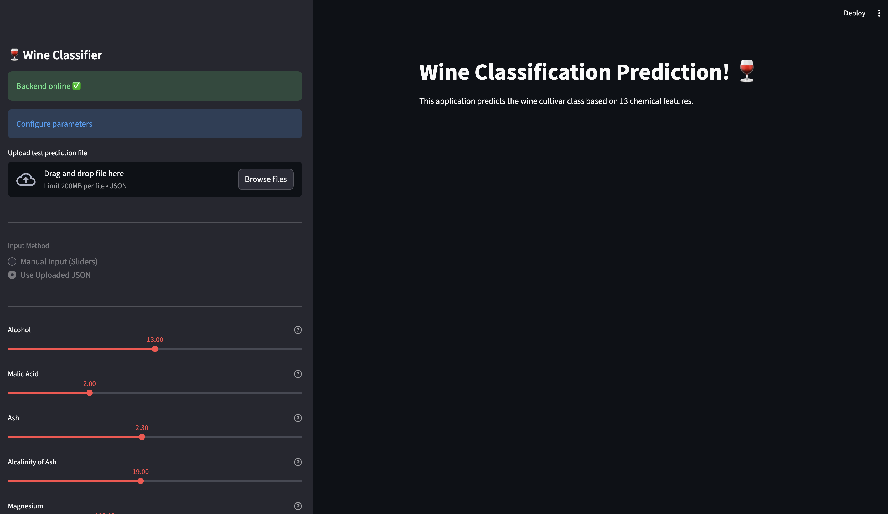
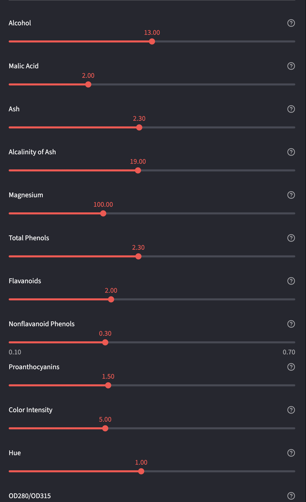
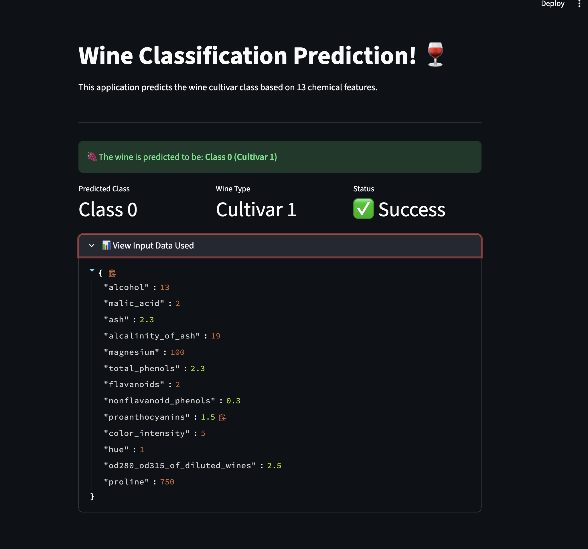

# Wine Classification with Streamlit Dashboard

An interactive **Streamlit** web application for wine classification using Machine Learning. This app predicts wine cultivar classes (0, 1, or 2) based on 13 chemical features using a Decision Tree Classifier, with FastAPI serving the ML model backend.



## Overview

This project demonstrates a full-stack ML application built with **Streamlit** for the frontend dashboard and **FastAPI** for the ML model backend. The application classifies wines from the sklearn Wine dataset into three cultivar classes based on their chemical composition.

### Tech Stack:
- **Frontend**: Streamlit (Interactive Dashboard)
- **Backend**: FastAPI (ML Model Server)
- **ML Model**: Scikit-learn Decision Tree Classifier
- **Dataset**: Wine Dataset (178 samples, 13 features, 3 classes)

---

## Streamlit Features

### Interactive Sidebar
- Real-time Backend Health Check - Monitor FastAPI server status
- File Upload Widget - Upload JSON test data with preview
- Input Method Toggle - Switch between manual sliders and JSON file input
- Configuration Panel - User-friendly parameter setup

### Manual Input Interface
- **13 Interactive Sliders** - One for each wine chemical feature
- **Dynamic Value Display** - Real-time value updates
- **Tooltips & Help Text** - Feature descriptions on hover
- **Range Validation** - Ensures values stay within valid ranges

### Prediction Display
- **Animated Results** - Balloons celebration on successful prediction
- **Metrics Dashboard** - Shows Predicted Class, Wine Type, and Status
- **Color-coded Feedback** - Green for success, red for errors
- **Expandable Input Preview** - View the exact data used for prediction

### User Experience Enhancements
- **Loading Spinners** - Visual feedback during prediction
- **Toast Notifications** - Non-intrusive status messages
- **Session State Management** - Maintains state across interactions
- **Responsive Layout** - Works on different screen sizes

---

## Live Demo Screenshots

### Full Dashboard Interface
Complete view showing sidebar with backend status, file upload, input method selection, and all 13 feature sliders:


### Feature Input Sliders
Detailed view of the interactive sliders for manual feature input with real-time value display:



### Prediction Results
Successful prediction showing Class 0 (Cultivar 1) with metrics, status, and expandable input data:



---

## Project Structure

```
SteamLit_Lab/
├── assets/                     # Screenshots and documentation images
│   ├── dashboard_full.png
│   ├── sliders_view.png
│   └── prediction_result.png
├── model/
│   └── wine_model.pkl         # Pre-trained Decision Tree model
├── src/
│   ├── __init__.py
│   ├── data.py                # Dataset loading and preprocessing
│   ├── main.py                # FastAPI backend server
│   ├── predict.py             # Model prediction logic
│   └── train.py               # Model training script
├── Dashboard.py               # Main Streamlit Application
├── requirements.txt           # Python dependencies
├── test_wine.json            # Sample test data
├── .gitignore
└── README.md
```

---

## Installation & Setup

### Prerequisites
- Python 3.11 or higher
- pip package manager
- Git

### Step 1: Clone the Repository
```bash
git clone git@github.com:saumith/SteamLit_Lab.git
cd SteamLit_Lab
```

### Step 2: Create & Activate Virtual Environment
```bash
# Create virtual environment
python3 -m venv streamlitenv

# Activate (macOS/Linux)
source streamlitenv/bin/activate

# Activate (Windows)
streamlitenv\Scripts\activate
```

### Step 3: Install Dependencies
```bash
pip install -r requirements.txt
```

### Dependencies Installed:
```
streamlit          # Dashboard framework
fastapi           # Backend API framework
uvicorn           # ASGI server
scikit-learn      # ML library
numpy             # Numerical computing
joblib            # Model serialization
requests          # HTTP client
pydantic          # Data validation
```

---

## Running the Application

### Quick Start (2 Terminals Required)

#### Terminal 1: Start FastAPI Backend
```bash
cd src
python -m uvicorn main:app --reload
```
Backend running at: **http://localhost:8000**

#### Terminal 2: Launch Streamlit Dashboard
```bash
# From project root directory
streamlit run Dashboard.py
```
Dashboard opens at: **http://localhost:8502**

### Verify Setup
1. Check Terminal 1 shows: `Uvicorn running on http://127.0.0.1:8000`
2. Streamlit dashboard opens automatically in your browser
3. Sidebar shows **"Backend online"** (green box)

---

## How to Use the Dashboard

### Method 1: Manual Input with Sliders

1. **Check Backend Status** - Ensure sidebar shows "Backend online"
2. **Select Input Method** - Click **"Manual Input (Sliders)"** radio button
3. **Adjust Feature Values** - Use 13 sliders to set wine chemical properties:
   - Alcohol (11.0 - 15.0%)
   - Malic Acid (0.5 - 6.0 g/L)
   - Ash (1.3 - 3.5 g/L)
   - ... and 10 more features
4. **Click Predict Button** - Watch the loading spinner
5. **View Results** - See predicted class, wine type, and celebration balloons

### Method 2: JSON File Upload

1. **Prepare JSON File** - Create a file with all 13 features (see example below)
2. **Upload File** - Click "Browse files" in sidebar
3. **Preview Data** - JSON content appears in sidebar preview box
4. **Select Method** - Choose **"Use Uploaded JSON"** radio button
5. **Click Predict** - Get instant prediction results
6. **Expand Details** - Click "View Input Data Used" to see exact values

### Understanding Results

The dashboard displays:
- **Predicted Class**: 0, 1, or 2
- **Wine Type**: Cultivar 1, 2, or 3
- **Status**: Success or Error
- **Input Data**: Expandable section showing all 13 feature values used

---

## Dataset & Model

### Wine Dataset Features

| Feature | Description | Range | Unit |
|---------|-------------|-------|------|
| Alcohol | Alcohol content | 11.0 - 15.0 | % |
| Malic Acid | Malic acid | 0.5 - 6.0 | g/L |
| Ash | Ash content | 1.3 - 3.5 | g/L |
| Alcalinity of Ash | Alkalinity | 10.0 - 30.0 | - |
| Magnesium | Magnesium | 70.0 - 162.0 | mg/L |
| Total Phenols | Phenol content | 0.9 - 4.0 | - |
| Flavanoids | Flavanoids | 0.3 - 5.1 | - |
| Nonflavanoid Phenols | Non-flavanoid | 0.1 - 0.7 | - |
| Proanthocyanins | Proanthocyanins | 0.4 - 3.6 | - |
| Color Intensity | Color | 1.0 - 13.0 | - |
| Hue | Hue value | 0.4 - 1.7 | - |
| OD280/OD315 | Dilution ratio | 1.2 - 4.0 | - |
| Proline | Proline | 278.0 - 1680.0 | mg/L |

### Target Classes

- **Class 0 (Cultivar 1)**: High alcohol, high flavanoids, very high proline
- **Class 1 (Cultivar 2)**: Medium characteristics across all features
- **Class 2 (Cultivar 3)**: High color intensity, lower flavanoids, lower hue

### Model Specifications

- **Algorithm**: Decision Tree Classifier
- **Max Depth**: 3 (prevents overfitting)
- **Train/Test Split**: 70% / 30%
- **Stratification**: Enabled (balanced class distribution)
- **Random State**: 12 (reproducible results)
- **Model File**: `model/wine_model.pkl` (pre-trained, included)

---

## API Integration

The Streamlit dashboard communicates with FastAPI backend via HTTP requests.

### Available Endpoints

#### 1. Health Check
```python
GET http://localhost:8000/
```
Response: `{"status": "healthy"}`

Used by Streamlit sidebar to display backend status.

#### 2. Predict Wine Class
```python
POST http://localhost:8000/predict
Content-Type: application/json
```

**Request Body:**
```json
{
  "alcohol": 13.5,
  "malic_acid": 2.3,
  "ash": 2.5,
  "alcalinity_of_ash": 16.0,
  "magnesium": 110.0,
  "total_phenols": 2.8,
  "flavanoids": 3.0,
  "nonflavanoid_phenols": 0.28,
  "proanthocyanins": 2.0,
  "color_intensity": 5.5,
  "hue": 1.04,
  "od280_od315_of_diluted_wines": 3.2,
  "proline": 1000.0
}
```

**Response:**
```json
{
  "response": 0
}
```

#### 3. Interactive API Docs
```
http://localhost:8000/docs
```
FastAPI auto-generates Swagger UI documentation.

---

## Testing Example

### Example: Class 0 (Cultivar 1)
**Characteristics**: High alcohol, high flavanoids, very high proline

**test_wine.json:**
```json
{
  "alcohol": 13.5,
  "malic_acid": 2.3,
  "ash": 2.5,
  "alcalinity_of_ash": 16.0,
  "magnesium": 110.0,
  "total_phenols": 2.8,
  "flavanoids": 3.0,
  "nonflavanoid_phenols": 0.28,
  "proanthocyanins": 2.0,
  "color_intensity": 5.5,
  "hue": 1.04,
  "od280_od315_of_diluted_wines": 3.2,
  "proline": 1000.0
}
```
**Expected Result**: Class 0 (Cultivar 1)

### How to Test

**Via Streamlit Dashboard:**
1. Copy the JSON above into a file named `test_wine.json`
2. Open Streamlit dashboard
3. Click "Browse files" and upload the JSON file
4. Select "Use Uploaded JSON" radio button
5. Click "Predict" button
6. Verify the predicted class is 0 (Cultivar 1)

**Via cURL:**
```bash
curl -X POST "http://localhost:8000/predict" \
     -H "Content-Type: application/json" \
     -d @test_wine.json
```

**Via Python:**
```python
import requests
import json

with open('test_wine.json') as f:
    data = json.load(f)

response = requests.post(
    'http://localhost:8000/predict',
    json=data
)
print(response.json())  # Output: {'response': 0}
```

---
